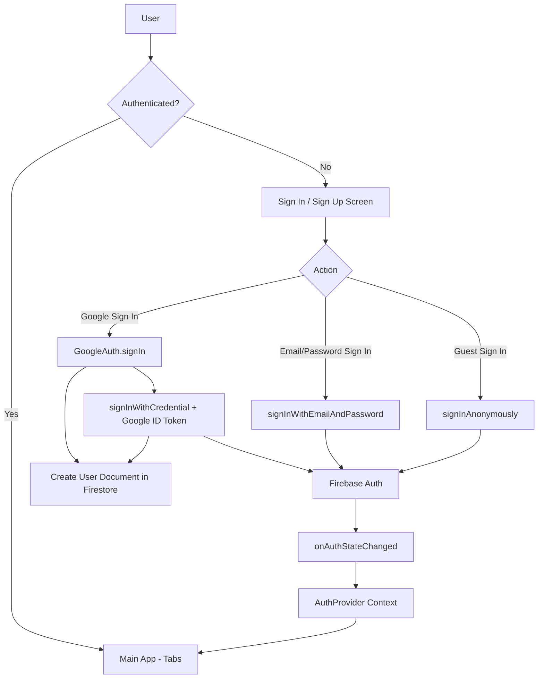

# Authentication Overview

This document provides a high-level overview of how account creation and login works in the Show Seek application.

## Table of Contents

- [Architecture Overview](#architecture-overview)
- [Key Packages & Dependencies](#key-packages--dependencies)
- [Firebase Configuration](#firebase-configuration)
- [Data Storage in Firebase](#data-storage-in-firebase)
- [Authentication Flows](#authentication-flows)
- [Key Files & Functions](#key-files--functions)
- [Auth Context & State Management](#auth-context--state-management)
- [Protected Actions (Auth Guard)](#protected-actions-auth-guard)

---

## Architecture Overview



> [!NOTE]
> Email/password **sign-up** has been deprecated. New users must create accounts via Google Sign-In.
> Legacy users can still sign in with email/password on the sign-in screen.

---

## Key Packages & Dependencies

| Package                                     | Version | Purpose                                     |
| ------------------------------------------- | ------- | ------------------------------------------- |
| `firebase`                                  | ^12.6.0 | Firebase SDK for Authentication & Firestore |
| `react-native-google-auth`                  | latest  | Google OAuth for Android Credential Manager |
| `@react-native-async-storage/async-storage` | 2.2.0   | Persists auth session across app restarts   |
| `@nkzw/create-context-hook`                 | ^1.1.0  | Creates the AuthProvider context hook       |
| `expo-router`                               | ~6.0.19 | Navigation and routing between auth screens |

---

## Firebase Configuration

Firebase is initialized in [`src/firebase/config.ts`](file:///Users/edufocal/Desktop/projects/show-seek/src/firebase/config.ts).

### Key Configuration

```typescript
import ReactNativeAsyncStorage from '@react-native-async-storage/async-storage';
import { initializeApp } from 'firebase/app';
import { initializeAuth, getReactNativePersistence } from 'firebase/auth';
import { getFirestore } from 'firebase/firestore';

const firebaseConfig = {
  apiKey: process.env.EXPO_PUBLIC_FIREBASE_API_KEY,
  authDomain: process.env.EXPO_PUBLIC_FIREBASE_AUTH_DOMAIN,
  projectId: process.env.EXPO_PUBLIC_FIREBASE_PROJECT_ID,
  storageBucket: process.env.EXPO_PUBLIC_FIREBASE_STORAGE_BUCKET,
  messagingSenderId: process.env.EXPO_PUBLIC_FIREBASE_MESSAGING_SENDER_ID,
  appId: process.env.EXPO_PUBLIC_FIREBASE_APP_ID,
};

// Auth initialized with AsyncStorage for session persistence
auth = initializeAuth(app, {
  persistence: getReactNativePersistence(ReactNativeAsyncStorage),
});
```

### Exports

- `auth` - Firebase Auth instance
- `db` - Firestore database instance
- `functions` - Firebase Cloud Functions instance

---

## Data Storage in Firebase

### Firestore Database Structure

When a user creates an account, a document is created in Firestore:

```
users/
  └── {userId}/                    # Document ID = Firebase Auth UID
        ├── uid: string            # User's Firebase UID
        ├── displayName: string    # User's chosen display name
        ├── email: string          # User's email address
        ├── createdAt: Timestamp   # Server timestamp of account creation
        └── photoURL: null         # Profile photo URL (initially null)
```

### User Sub-collections

Each user document can have the following sub-collections (managed elsewhere in the app):

```
users/{userId}/
  ├── favorites/        # User's favorite movies/shows
  ├── watchlist/        # User's watchlist items
  └── ratings/          # User's media ratings
```

---

## Authentication Flows

### 1. Google Sign-In Flow (Primary)

**Files:**

- [`app/(auth)/sign-in.tsx`](<file:///Users/edufocal/Desktop/projects/show-seek/app/(auth)/sign-in.tsx>)
- [`app/(auth)/sign-up.tsx`](<file:///Users/edufocal/Desktop/projects/show-seek/app/(auth)/sign-up.tsx>)
- [`src/firebase/auth.ts`](file:///Users/edufocal/Desktop/projects/show-seek/src/firebase/auth.ts)

**Steps:**

1. User taps "Sign in with Google" button
2. `GoogleAuth.signIn()` launches Android Credential Manager
3. User selects Google account
4. App receives ID token from Google
5. Call `signInWithCredential(auth, GoogleAuthProvider.credential(idToken))`
6. Create/update user document in Firestore via `createUserDocument()`
7. Auth state change triggers redirect

**Error Handling:**
| Error Code | User Message |
|------------|--------------|
| `auth/account-exists-with-different-credential` | An account already exists with this email |
| `auth/credential-already-in-use` | This Google account is already linked |
| `auth/network-request-failed` | Network error |

---

### 2. Sign Up Flow (Email/Password) — DEPRECATED

> [!WARNING]
> Email/password sign-up has been removed. New users must create accounts via Google Sign-In.
> The sign-up screen now only shows the "Sign up with Google" button.

### 2. Sign In Flow (Email/Password)

**File:** [`app/(auth)/sign-in.tsx`](<file:///Users/edufocal/Desktop/projects/show-seek/app/(auth)/sign-in.tsx>)

**Steps:**

1. User enters email and password
2. Client-side validation (both fields required)
3. Call `signInWithEmailAndPassword(auth, email, password)`
4. Auth state change triggers redirect

**Firebase Auth Functions Used:**

- `signInWithEmailAndPassword()`

**Error Handling:**
| Error Code | User Message |
|------------|--------------|
| `auth/invalid-credential` | Invalid email or password |
| `auth/user-not-found` | Invalid email or password |
| `auth/wrong-password` | Invalid email or password |
| `auth/user-disabled` | Account has been disabled |
| `auth/too-many-requests` | Too many failed attempts |

---

### 3. Guest Sign In Flow (Anonymous)

**File:** [`app/(auth)/sign-in.tsx`](<file:///Users/edufocal/Desktop/projects/show-seek/app/(auth)/sign-in.tsx>)

**Steps:**

1. User taps "Continue as Guest"
2. Call `signInAnonymously(auth)`
3. Redirect to `/(tabs)/home`

**Firebase Auth Functions Used:**

- `signInAnonymously()`

> [!IMPORTANT]
> Guest users have limited functionality. The `useAuthGuard` hook checks `user.isAnonymous` to prompt sign-in for protected actions.

---

### 4. Sign Out Flow

**File:** [`src/context/auth.ts`](file:///Users/edufocal/Desktop/projects/show-seek/src/context/auth.ts)

**Steps:**

1. Call `signOut()` from the auth context
2. Firebase Auth session is cleared
3. User is redirected to auth screens

**Firebase Auth Functions Used:**

- `signOut()` from `firebase/auth`

---

## Key Files & Functions

### Authentication Screens

| File                                                                                                   | Purpose                                              |
| ------------------------------------------------------------------------------------------------------ | ---------------------------------------------------- |
| [`app/(auth)/_layout.tsx`](<file:///Users/edufocal/Desktop/projects/show-seek/app/(auth)/_layout.tsx>) | Auth stack layout (headerless)                       |
| [`app/(auth)/sign-in.tsx`](<file:///Users/edufocal/Desktop/projects/show-seek/app/(auth)/sign-in.tsx>) | Sign in screen with email/password and guest options |
| [`app/(auth)/sign-up.tsx`](<file:///Users/edufocal/Desktop/projects/show-seek/app/(auth)/sign-up.tsx>) | Account creation screen                              |

### Core Firebase Files

| File                                                                                                       | Purpose                                  |
| ---------------------------------------------------------------------------------------------------------- | ---------------------------------------- |
| [`src/firebase/config.ts`](file:///Users/edufocal/Desktop/projects/show-seek/src/firebase/config.ts)       | Firebase initialization and exports      |
| [`src/firebase/firestore.ts`](file:///Users/edufocal/Desktop/projects/show-seek/src/firebase/firestore.ts) | Firestore helper functions for user data |

### Context & Hooks

| File                                                                                                                       | Purpose                                   |
| -------------------------------------------------------------------------------------------------------------------------- | ----------------------------------------- |
| [`src/context/auth.ts`](file:///Users/edufocal/Desktop/projects/show-seek/src/context/auth.ts)                             | Auth context provider and `useAuth` hook  |
| [`src/hooks/useAuthGuard.tsx`](file:///Users/edufocal/Desktop/projects/show-seek/src/hooks/useAuthGuard.tsx)               | Protects actions requiring authentication |
| [`src/components/AuthGuardModal.tsx`](file:///Users/edufocal/Desktop/projects/show-seek/src/components/AuthGuardModal.tsx) | Modal prompting guest users to sign in    |

---

## Auth Context & State Management

### AuthProvider

**File:** [`src/context/auth.ts`](file:///Users/edufocal/Desktop/projects/show-seek/src/context/auth.ts)

The `AuthProvider` wraps the app and provides authentication state via the `useAuth` hook.

**State:**

```typescript
{
  user: User | null,           // Current Firebase user (null if not signed in)
  loading: boolean,            // True while checking initial auth state
  hasCompletedOnboarding: boolean | null,
  signOut: () => Promise<void>,
  completeOnboarding: () => Promise<void>,
}
```

**How It Works:**

1. On app load, `onAuthStateChanged` listener is set up
2. Firebase calls the listener with the current user (or null)
3. `loading` becomes false once the initial state is known
4. Components use `useAuth()` to access the current user

```typescript
// Monitor auth state
useEffect(() => {
  const unsubscribe = onAuthStateChanged(auth, (currentUser) => {
    setUser(currentUser);
    setLoading(false);
  });
  return unsubscribe;
}, []);
```

---

## Protected Actions (Auth Guard)

### useAuthGuard Hook

**File:** [`src/hooks/useAuthGuard.tsx`](file:///Users/edufocal/Desktop/projects/show-seek/src/hooks/useAuthGuard.tsx)

This hook protects actions that require a signed-in (non-guest) user.

**Authentication Check:**

```typescript
const isAuthenticated = !loading && user !== null && user.isAnonymous === false;
```

**Usage:**

```tsx
const { requireAuth, isAuthenticated, AuthGuardModal } = useAuthGuard();

const handleAddToList = () => {
  requireAuth(async () => {
    await addMovieToList(movieId, listId);
  }, 'Sign in to add items to your lists');
};

return (
  <>
    <Button onPress={handleAddToList}>Add to List</Button>
    {AuthGuardModal}
  </>
);
```

### AuthGuardModal Component

**File:** [`src/components/AuthGuardModal.tsx`](file:///Users/edufocal/Desktop/projects/show-seek/src/components/AuthGuardModal.tsx)

A modal that appears when guest/unauthenticated users attempt protected actions.

**Features:**

- Displays customizable message
- "Sign In" button navigates to `/(auth)/sign-in`
- "Maybe Later" button dismisses the modal

---

## Session Persistence

Firebase Auth sessions are persisted using `AsyncStorage`:

```typescript
auth = initializeAuth(app, {
  persistence: getReactNativePersistence(ReactNativeAsyncStorage),
});
```

This means:

- Users remain signed in after closing/reopening the app
- Sessions persist until explicit sign out or token expiration
- Works across app restarts and device reboots

---

## Summary

| Feature                 | Implementation                                                               |
| ----------------------- | ---------------------------------------------------------------------------- |
| **Email/Password Auth** | Firebase Auth `createUserWithEmailAndPassword`, `signInWithEmailAndPassword` |
| **Guest Access**        | Firebase Auth `signInAnonymously`                                            |
| **Session Persistence** | AsyncStorage with `getReactNativePersistence`                                |
| **State Management**    | React Context via `@nkzw/create-context-hook`                                |
| **User Data Storage**   | Firestore `users/{uid}` document                                             |
| **Protected Actions**   | `useAuthGuard` hook + `AuthGuardModal`                                       |
| **Navigation**          | Expo Router with `/(auth)` stack                                             |
